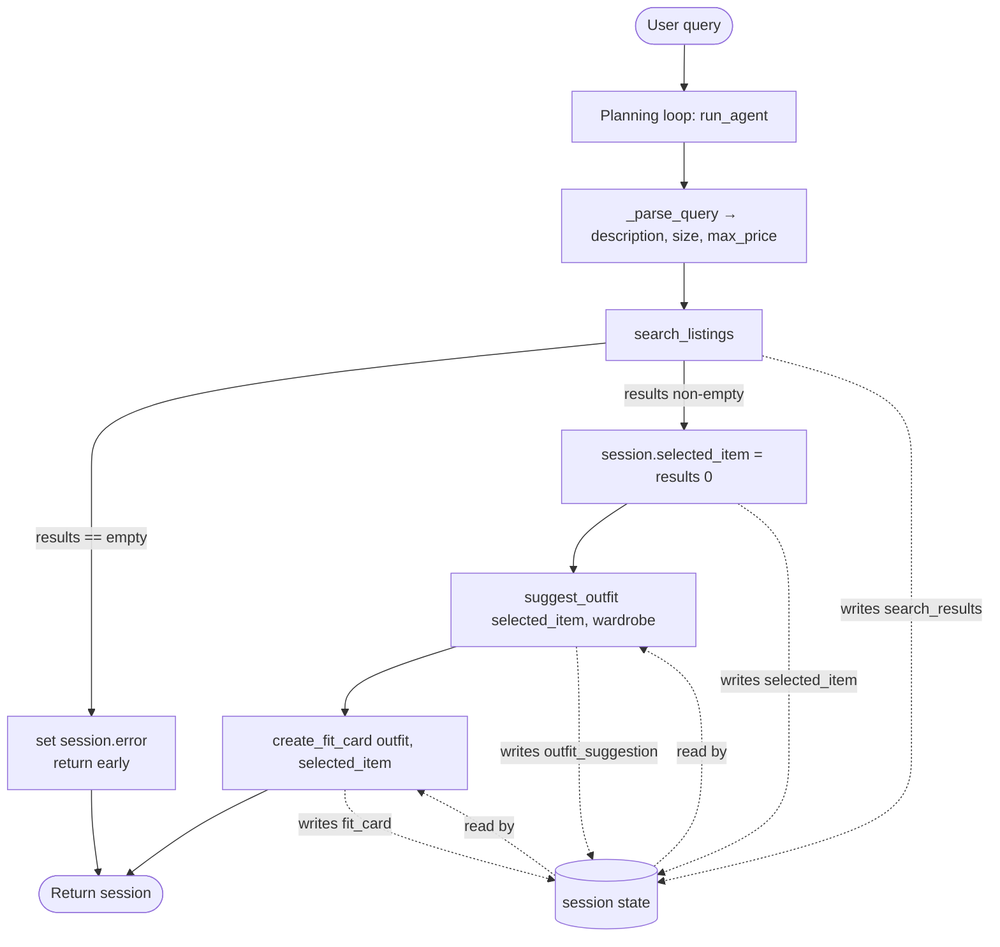

# FitFindr — planning.md

> Spec written before implementation. Updated before any stretch features.

---

## Tools

### Tool 1: search_listings

**What it does:**
Searches the 40-item mock listings dataset for pieces matching the user's keywords, with optional size and price filters, and returns them ranked by how relevant they are to the query.

**Input parameters:**
- `description` (str): keywords describing the wanted item, e.g. `"vintage graphic tee"`.
- `size` (str | None): size to filter by (case-insensitive substring match — `"M"` matches `"S/M"`); `None` skips size filtering.
- `max_price` (float | None): inclusive price ceiling; `None` skips price filtering.

**What it returns:**
A `list[dict]` of matching listings sorted best-match-first. Each dict has `id`, `title`, `description`, `category`, `style_tags` (list), `size`, `condition`, `price` (float), `colors` (list), `brand`, `platform`. Returns `[]` when nothing matches.

**What happens if it fails or returns nothing:**
Returns an empty list — never raises. The planning loop detects the empty list and stops with a helpful message instead of calling `suggest_outfit` on nothing.

---

### Tool 2: suggest_outfit

**What it does:**
Takes the chosen item plus the user's wardrobe and asks the LLM for 1–2 concrete outfit combinations that pair the new item with pieces the user already owns.

**Input parameters:**
- `new_item` (dict): the selected listing dict.
- `wardrobe` (dict): wardrobe with an `items` list of `{id, name, category, colors, style_tags, notes}`. May be empty.

**What it returns:**
A non-empty styling string. With a populated wardrobe it names specific owned pieces; with an empty wardrobe it returns general styling advice for the item.

**What happens if it fails or returns nothing:**
Empty wardrobe is handled as a normal branch (general advice, not an error). If the LLM call itself raises, the tool catches it and returns a short fallback string so the agent never crashes.

---

### Tool 3: create_fit_card

**What it does:**
Turns the outfit suggestion into a short, casual, shareable caption (OOTD-style) for the thrifted find.

**Input parameters:**
- `outfit` (str): the suggestion string from `suggest_outfit`.
- `new_item` (dict): the selected listing dict (for title, price, platform).

**What it returns:**
A 2–4 sentence caption that mentions the item, price, and platform once each. Uses a high temperature (0.95) so repeated calls on the same input read differently.

**What happens if it fails or returns nothing:**
If `outfit` is empty/whitespace it returns a descriptive error string *before* calling the LLM. If the LLM call raises, it returns a plain fallback caption — never an exception.

---

### Additional Tools (if any)

None for the required build. Candidate stretch tool: `compare_price(item)` to estimate whether a listing's price is fair against comparable items in the dataset. (Will update this file before starting it.)

---

## Planning Loop

The loop is **conditional on what `search_listings` returns** — it is not a fixed 3-call pipeline:

1. Parse the query into `description`, `size`, `max_price` (stored in `session["parsed"]`).
2. Call `search_listings(description, size, max_price)` → `session["search_results"]`.
3. **Branch on the result:**
   - If `search_results` is empty → set `session["error"]` to a specific, actionable message and **return early**. Do not call `suggest_outfit` or `create_fit_card`.
   - If `search_results` is non-empty → set `session["selected_item"] = search_results[0]` and continue.
4. Call `suggest_outfit(selected_item, wardrobe)` → `session["outfit_suggestion"]`.
5. Call `create_fit_card(outfit_suggestion, selected_item)` → `session["fit_card"]`.
6. Return the session.

The loop is "done" when either the error branch returns early or `fit_card` is populated. The agent behaves differently for an impossible query (one tool call, error returned) than for a matchable one (all three tools run).

---

## State Management

A single `session` dict (created by `_new_session`) is the source of truth for one interaction. Each step writes its output into the session and later steps read from it — nothing is re-entered by the user:

- `search_listings` result → `session["search_results"]` → top item copied to `session["selected_item"]`.
- `session["selected_item"]` is passed into `suggest_outfit`; its result → `session["outfit_suggestion"]`.
- `session["outfit_suggestion"]` and `session["selected_item"]` are passed into `create_fit_card`; its result → `session["fit_card"]`.
- `session["error"]` is `None` on success and a string when the interaction ended early.

`run_agent` returns the whole session, so the UI can read every intermediate value.

---

## Error Handling

| Tool | Failure mode | Agent response |
|------|-------------|----------------|
| search_listings | No results match the query | Loop sets `session["error"]` naming the query + active filters and suggesting fixes (loosen price, drop size, broaden keywords), then returns early without calling later tools. |
| suggest_outfit | Wardrobe is empty | Returns general styling advice for the item instead of failing; loop continues normally. (LLM exceptions are caught and a fallback string returned.) |
| create_fit_card | Outfit input is missing or incomplete | Returns a descriptive error string ("Can't build a fit card without an outfit suggestion…") before any LLM call; never raises. |

---

## Architecture

---

## AI Tool Plan

> NOTE TO SELF: rewrite this in my own voice to reflect exactly how I prompted the AI and what I changed — graders and the demo expect my real process.

**Milestone 3 — Individual tool implementations:**
For each tool I'll paste its block above (inputs, return value, failure mode) into the AI tool and ask it to implement that one function in `tools.py` using `load_listings()` from the data loader. Before trusting the output I'll check: does the signature match my spec exactly, and does it handle the documented failure mode? Then I'll run each tool against test inputs (a matching query, a no-match query, an empty wardrobe, an empty outfit string).

**Milestone 4 — Planning loop and state management:**
I'll give the AI my Planning Loop + State Management sections and the architecture diagram, and ask it to implement `run_agent` following the numbered steps. Before running I'll verify it branches on the `search_listings` result, stores values in the session dict, and does NOT call all three tools unconditionally.

---

## A Complete Interaction (Step by Step)

**Example user query:** "I'm looking for a vintage graphic tee under $30. I mostly wear baggy jeans and chunky sneakers. What's out there and how would I style it?"

**Step 1:** `_parse_query` extracts `description="vintage graphic tee"`, `size=None`, `max_price=30.0`. `run_agent` calls `search_listings("vintage graphic tee", None, 30.0)`, which returns the matching tees ranked by relevance. The top result is stored as `session["selected_item"]`.

**Step 2:** Because results were non-empty, the agent calls `suggest_outfit(selected_item, wardrobe)`. The wardrobe (baggy jeans, chunky sneakers, etc.) flows in from session state — the user does not re-enter it — and the LLM returns a concrete outfit. Stored in `session["outfit_suggestion"]`.

**Step 3:** The agent calls `create_fit_card(outfit_suggestion, selected_item)`, which returns a casual caption mentioning the tee, its price, and platform. Stored in `session["fit_card"]`.

**Final output to user:** Three panels — the top listing (title, price, platform, condition, description), the outfit idea, and the shareable fit card. If `search_listings` had returned nothing, the user would instead see one message explaining what failed and what to try.